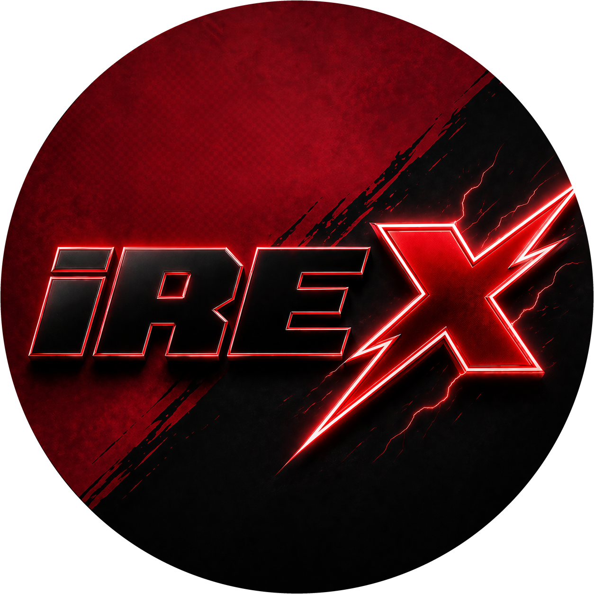

# iRefinedX

`iRefinedX` is a Windows desktop app that reuses the installed local iRacing UI and injects the `iRefinedX` enhancement layer into the official runtime.

It is not a fake clone of the iRacing UI. It boots the real local Electron app, keeps the native preload, local service, viewer integration and session handoff, then layers the `iRefinedX` features on top.

## Documentation

- Wiki: [github.com/nishizumi-maho/iRefinedX/wiki](https://github.com/nishizumi-maho/iRefinedX/wiki)
- Research/reference docs: [docs/research](docs/research)
- Releases: [github.com/nishizumi-maho/iRefinedX/releases](https://github.com/nishizumi-maho/iRefinedX/releases)
- Third-party notices: [THIRD_PARTY_NOTICES.md](THIRD_PARTY_NOTICES.md)

The wiki is the primary technical reference. It documents the runtime architecture, feature behavior, storage model, privacy boundaries, troubleshooting and release flow in detail.

## What It Does

- boots the official local iRacing UI instead of replacing it
- keeps native register, withdraw, launch and viewer behavior
- adds queue tools for future sessions while preserving native register buttons for open sessions
- keeps a separate `Queue for next race` action available in the top race queue area even after registration opens
- keeps the lower queue/status bar visible across app restarts
- adds the full-width `Intelligence Center` dashboard widget
- provides session JSON sharing and export helpers where the local UI supports them
- checks GitHub Releases and warns the user when a newer `iRefinedX` version exists

## What It Does Not Do

- it does not replace the installed iRacing binaries with a custom client
- it does not bypass iRacing authentication
- it does not automate driving inputs
- it does not keep queue automation alive while the app is closed
- it does not ship the iRacing UI itself inside this repository

## Requirements

- Windows
- local iRacing installation with the official `iRacingUI.exe`
- Node.js for source-based local builds
- an authenticated iRacing account

## Quick Install From The `.exe`

1. Download the latest `iRefinedX-Setup-*.exe` from [GitHub Releases](https://github.com/nishizumi-maho/iRefinedX/releases).
2. Close `iRefinedX` and the official `iRacing UI` before running the installer or uninstaller.
3. Run the installer and keep `Create a desktop shortcut` enabled unless you explicitly do not want a dedicated shortcut.
4. Leave `Start iRefinedX when Windows starts` off unless you want the launcher to auto-start with Windows.
5. Finish the install and open `iRefinedX` from its own shortcut.
6. If `iRefinedX` asks for the iRacing UI folder, point it to the iRacing root folder or the `ui` folder once.

## Everyday Use

- Open the normal `iRacing UI` shortcut when you want the untouched official UI.
- Open the `iRefinedX` shortcut when you want the injected UI with `iRefinedX` features.
- Use the purple `IREF` button in the bottom bar to open the `iRefinedX` menu at any time.
- When iRacing updates the official UI, launch `iRefinedX` again and it will rebuild the injected layer automatically on top of the new official files.
- To update `iRefinedX`, download the newer installer and run it over the existing install.
- To uninstall `iRefinedX`, close `iRefinedX` and `iRacing UI` first. The uninstaller restores the official UI files before removing the app.

## Bottom `IREF` Menu

The purple `IREF` button in the lower bar opens the main `iRefinedX` settings panel.

The current menu includes options for:

- Test Drive session sharing buttons
- Hosted/League session tools
- hiding or showing the Go Racing JSON export buttons
- enabling the future-session queue system
- re-queueing displaced registrations
- queue register sound, sound volume and a sound test button
- showing session type on the join button
- showing or hiding the Dashboard `Intelligence Center`
- hiding notifications or auto-closing them after a delay
- hiding sidebars or collapsing the left menu
- showing local `iRefinedX` log messages

The same menu also shows the in-app update note when a newer `iRefinedX` release is available.

## Local Build And Run

1. Build the enhancement layer:
   - `npm --prefix extension install`
   - `npm --prefix extension run build`
2. Install launcher dependencies:
   - `npm --prefix desktop install`
3. Start `iRefinedX`:
   - `npm --prefix desktop start`

The launcher patches the extracted local iRacing UI runtime in place, then starts the official `iRacingUI.exe`.

## Installer Model

The Windows installer ships `iRefinedX` as its own app and shortcut. It does not overwrite the official iRacing shortcut or replace the official installation entry point.

On install, the user can choose:

- create a desktop shortcut
- start `iRefinedX` automatically with Windows

The desktop shortcut option is enabled by default because the intended access model is:

- official `iRacing UI` shortcut for the untouched runtime
- `iRefinedX` shortcut for the injected runtime

On first launch, `iRefinedX` tries to find the official iRacing UI automatically by checking:

- the saved `iRefinedX` UI path cache
- the `iracing://` protocol association in the Windows registry
- common default install paths such as `C:\Program Files (x86)\iRacing\ui` and `D:\Program Files (x86)\iRacing\ui`

If none of those match, the app opens a folder picker so the user can point `iRefinedX` at the installed iRacing directory once, then reuses that location on later launches.

## Update Model

`iRefinedX` checks [GitHub Releases](https://github.com/nishizumi-maho/iRefinedX/releases) and shows a visible popup when a newer version is available.

The updater only notifies. It does not silently self-update. The intended release artifact is a downloadable `iRefinedX` installer published on GitHub Releases.

Stable builds ignore newer prereleases by default. Once a newer stable release is published, `iRefinedX` notifies the user through:

- a native desktop popup
- an in-app update button
- an update note inside the settings panel

## Note For iRacing Staff

`iRefinedX` intentionally avoids the `remote debugging` / DevTools-port model.

The runtime model used here is:

- preserve the official local UI bundle as `app.irx-original.asar`
- build the `iRefinedX` layer from that local official bundle
- route launch mode locally between the untouched official runtime and the injected runtime
- keep the official Electron preload, local service integration, register/withdraw flows and session handoff

Why this is materially safer than relying on a DevTools port:

- `iRefinedX` does not open a Chrome DevTools Protocol socket such as `--remote-debugging-port=9222`
- it does not expose a general-purpose localhost control channel that another local process can attach to while the UI is running
- it does not depend on a live external debugger session to inspect, mutate or drive the app
- it does not ship a private update service, hidden downloader or remote command path

From an attack-surface perspective, that is narrower than a design that keeps a DevTools/CDP endpoint open.

The project still modifies local UI files, but it does so in a constrained and reversible way:

- the official bundle is preserved locally and restored on uninstall
- launching the normal `iRacing UI` shortcut uses the untouched official runtime
- launching the `iRefinedX` shortcut uses the injected runtime
- when the official UI updates, `iRefinedX` rebuilds its derived runtime from the new local official files

Just as important, this project does not try to cross iRacing trust boundaries:

- it does not bypass authentication or entitlement checks
- it does not automate driving or inject simulator inputs
- it does not replace the official local services with an alternate backend
- it does not silently self-update or replace binaries in the background

In short: this is a local runtime patching approach with no exposed DevTools socket, no remote debugger dependency and no extra network control plane beyond what the official UI already uses.

## Security And Privacy Summary

- repository review on 2026-04-24 checked for obvious secrets, Electron debug switches, local listener/server code, updater behavior and local-data handling
- `npm audit --omit=dev --prefix extension`: clean
- `npm audit --omit=dev --prefix desktop`: clean
- GitHub CodeQL and dependency audit automation are configured in repository workflows
- tracked source was scanned for obvious secrets and credentials
- no `remote-debugging-port` switch or DevTools-port bootstrap is configured in tracked source
- no HTTP/WebSocket server is started by `iRefinedX` itself in tracked source
- runtime logs, extracted app files, build output and local analysis folders are gitignored
- queue state and settings are stored locally on the machine running the app
- update checks go only to public GitHub Releases metadata and are notification-only
- verbose network diagnostics are opt-in through `IREFINED_VERBOSE_NETWORK_LOGS=1`

## Repository Layout

- [`desktop/`](desktop): launcher, runtime patching and desktop-specific instrumentation
- [`extension/`](extension): browser extension source and build config
- [`docs/wiki/`](docs/wiki): source for the GitHub wiki
- [`docs/research/`](docs/research): deeper analysis/reference material
- [`THIRD_PARTY_NOTICES.md`](THIRD_PARTY_NOTICES.md): third-party notices kept with the MIT-licensed source tree

## Support and Issues

- Use GitHub Issues for bug reports and feature requests.
- Include the `iRefinedX` version, the iRacing UI version, the affected page and a screenshot when the issue is UI-related.

## License and Affiliation

This repository is MIT licensed. `iRefinedX` is not affiliated with iRacing.
